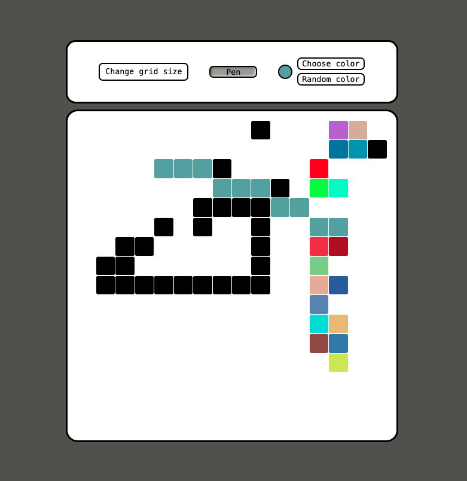

# Etch-a-Sketch

A browser-based grid drawing game inspired by the classic Etch-a-Sketch toy. Hover over the grid to draw with different colors and grid sizes.

**[Live Demo](https://kondrashar.github.io/Etch-a-Sketch/)**

## Features

- **Pen tool** — draw by hovering over grid tiles
- **Color picker** — choose from 9 preset colors via dropdown
- **Random color mode** — each tile gets a unique random color
- **Adjustable grid size** — resize the grid from 1×1 up to 100×100
- **Color indicator** — displays the currently active color (rainbow gradient for random mode)

## Built With

- HTML
- CSS
- JavaScript

No frameworks or libraries — everything is vanilla JS and hand-written CSS.

## How to Use

1. Open the [live demo](https://kondrashar.github.io/Etch-a-Sketch/) or clone the repo and open `index.html` in your browser
2. Hover over the grid to draw
3. Click **Choose color** to pick a preset color, or **Random color** for a new color on every tile
4. Click **Change grid size** to set a custom grid (1–100)
